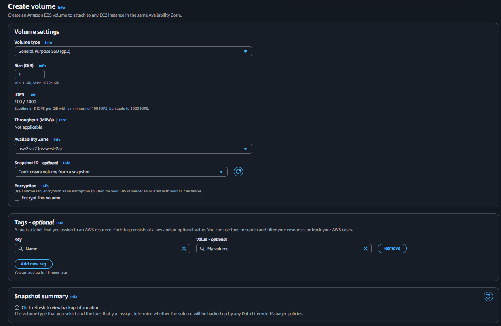
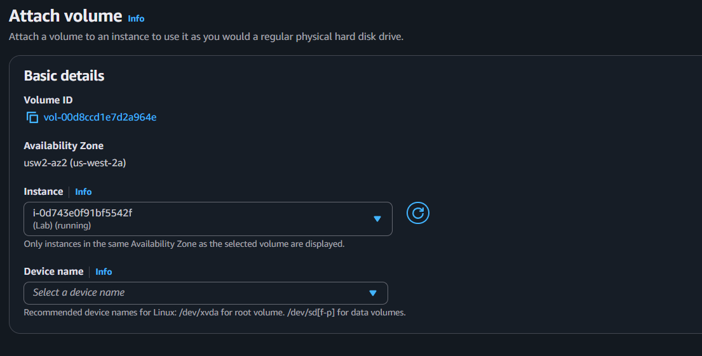
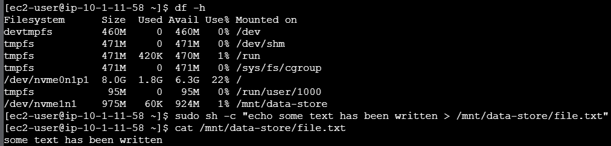
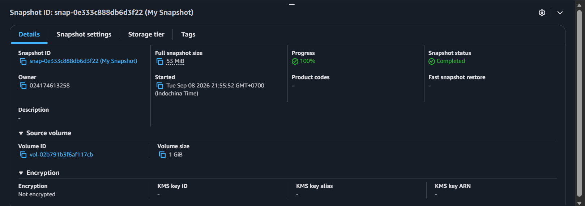
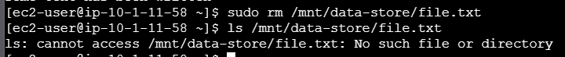
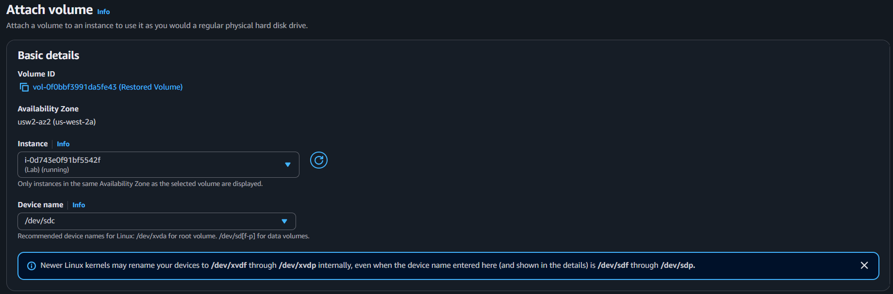
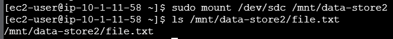

# AWS Elastic Block Store (EBS) Operations & Data Recovery

## Overview
This repository documents the practical implementation of Amazon Elastic Block Store (EBS) lifecycle management and disaster recovery strategies using the AWS Management Console and Linux OS administration. The project demonstrates how to provision block storage, attach and format volumes on an Amazon EC2 Linux instance, execute point-in-time snapshot backups, simulate accidental data loss, and successfully restore data from a snapshot.

---

## Technical Skills Demonstrated
* AWS Storage Services: Amazon EBS (gp2 volume creation, volume attachment, snapshotting, snapshot restoration).
* AWS Compute Services: Amazon EC2, EC2 Instance Connect.
* Linux System Administration: Block device management, filesystem creation (mkfs.ext3), mount points, persistent mount configuration (/etc/fstab), storage inspection (df -h).
* Disaster Recovery Strategy: Point-in-time recovery, volume rebuilding, backup validation.

---

## Architecture & Data Flow

1. Volume Provisioning & Attachment:
   - Create a 1 GiB General Purpose SSD (gp2) EBS volume in the same Availability Zone as the EC2 instance.
   - Attach the volume to the EC2 instance at /dev/sdb.

2. Filesystem Setup & Data Creation:
   - Format /dev/sdb to the ext3 filesystem.
   - Mount the block device to /mnt/data-store.
   - Configure persistent mounting across reboot cycles using /etc/fstab.
   - Write persistent data (file.txt) to the mounted volume.

3. Backup & Simulated Data Loss:
   - Take an EBS Snapshot (My Snapshot) of the volume storing the data.
   - Simulate catastrophic data loss by deleting file.txt from the primary filesystem.

4. Restoration & Verification:
   - Create a new EBS volume (Restored Volume) directly from My Snapshot.
   - Attach Restored Volume to the EC2 instance at /dev/sdc.
   - Mount the restored volume to a secondary path /mnt/data-store2.
   - Verify complete data recovery.

---

## Implementation Steps & Verification

### Step 1: Create an Amazon EBS Volume
Provisioned a 1 GiB General Purpose SSD (gp2) volume in the target Availability Zone.



---

### Step 2: Attach Volume to EC2 Instance
Attached My Volume to the running EC2 instance under device path /dev/sdb.



---

### Step 3: Format, Mount Filesystem & Write Data
Formatted the block device using ext3, mounted it to /mnt/data-store, configured /etc/fstab, and created a test file.

```bash
sudo mkfs -t ext3 /dev/sdb
sudo mkdir /mnt/data-store
sudo mount /dev/sdb /mnt/data-store
echo "/dev/sdb   /mnt/data-store ext3 defaults,noatime 1 2" | sudo tee -a /etc/fstab
sudo sh -c "echo some text has been written > /mnt/data-store/file.txt"
```



---

### Step 4: Create EBS Snapshot
Created a point-in-time backup snapshot named My Snapshot stored redundantly in Amazon S3.



---

### Step 5: Simulate Data Loss
Deleted the original file from the primary volume to simulate operational loss or corruption.

```bash
sudo rm /mnt/data-store/file.txt
ls /mnt/data-store/file.txt
```



---

### Step 6: Restore Volume from Snapshot
Created a new volume named Restored Volume using My Snapshot and attached it to /dev/sdc.



---

### Step 7: Mount Restored Volume & Verify Data Integrity
Mounted the newly restored volume to /mnt/data-store2 and confirmed the file was fully recovered.

```bash
sudo mkdir /mnt/data-store2
sudo mount /dev/sdc /mnt/data-store2
ls /mnt/data-store2/file.txt
```



---

## Repository Structure

```text
.
├── README.md
└── images/
    ├── 01-ebs-volume-created.png
    ├── 02-ebs-volume-attached.png
    ├── 03-filesystem-mounted-and-file-created.png
    ├── 04-ebs-snapshot-completed.png
    ├── 05-original-file-deleted.png
    ├── 06-restored-volume-attached.png
    └── 07-data-restored-from-snapshot.png
```
